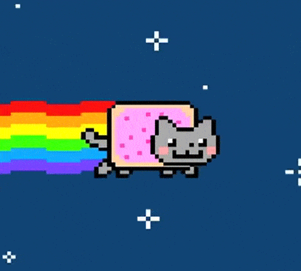

## [%DB%B6;Welcome+to+my+Repositories)](https://github.com/ZZSZSZSZZ)

**带着创意和乐趣，打造独特的个人项目 😜**
 

### 🛠 Tech Stack and Tools

| End                                                                  | Stack                                                                                                                                                                                                                                                                                                                       |
| -------------------------------------------------------------------- | --------------------------------------------------------------------------------------------------------------------------------------------------------------------------------------------------------------------------------------------------------------------------------------------------------------------------- |
|  |     |
|    |                                                                                                                                                                      |
|      | ![GitHub Action][gitHub-action]                                                                                                                                                                        |
|            |                                                    |
|            |       [![Gitmoji][gitmoji]][gcw]                                                                                           |

[gitHub-action]: https://img.shields.io/badge/-GitHub_Actions-black?style=flat&logo=github
[gitmoji]: https://img.shields.io/badge/-😉_Gitmoji_Commit_Workflow-black?style=flat
[gcw]: https://github.com/arvinxx/gitmoji-commit-workflow

### Github 活跃度

